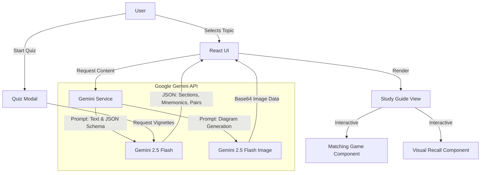

# 🏥 MedRecap AI

**Rapid Clinical Integration for Doctors & Students.**
> Bridges the gap between Foundational Sciences (Year 1) and Clinical Application (Year 3) using **Google Gemini 2.5**.

---

## ✨ Features

<strong>🧠 AI-Powered Study Guides</strong>

*   **Generative Curriculum**: Instantly creates structured study guides for *any* medical topic.
*   **Dual-View Learning**:
    *   📘 **Foundational**: Anatomy, Embryology, Physiology, and Surface Landmarks.
    *   🏥 **Clinical**: Pathology, Surgical Landmarks, and Procedural Relevance.
*   **Surface Anatomy Focus**: Specifically optimized to include physical exam landmarks (e.g., auscultation points, vertebral levels).

<strong>🎮 Active Recall Games</strong>

*   **Matching Game**: Interactive tile-matching mini-game generated for every section. Matches terms to definitions (e.g., Structure ↔ Function) to reinforce memory.
*   **Visual Recall**: Generates anatomical diagrams using **Gemini 2.5 Flash Image**. Includes a **Hide/Reveal** toggle to test mental visualization before seeing the answer.

<strong>📝 Smart Quiz System</strong>

*   **Clinical Vignettes**: Generates USMLE-style scenario questions.
*   **Progress Navigator**: Visual bar to track answered, skipped, and current questions.
*   **Review Mode**: Ability to **Skip** questions and review them later before submitting.
*   **Detailed Explanations**: Immediate feedback with reasoning for correct/incorrect answers.

<strong>💡 Memory Aids</strong>

*   **Mnemonics**: Automatically generates clever acronyms and memory hooks for complex lists.
*   **High-Yield Key Points**: Summarizes rapid-fire facts for quick review.

---

## 🏗️ Architecture

The application is built as a client-side Single Page Application (SPA) leveraging the latest **Google Gemini Models** for real-time content generation.

### 🧩 System Flow

### 🛠️ Tech Stack

*   **Frontend**: React 19, TypeScript
*   **Styling**: Tailwind CSS
*   **Icons**: Lucide React
*   **AI Core**: `@google/genai` SDK
*   **Models**: `gemini-2.5-flash` (Logic/Text), `gemini-2.5-flash-image` (Diagrams)

---

## 🚀 How to Use

1.  **Select a Topic**: Choose from suggested "Clinical Anatomy" topics (e.g., Thoracic Surface Anatomy) or search for your own.
2.  **Study Phase**:
    *   Read the **Foundational** vs **Clinical** cards.
    *   Play the **Matching Game** to lock in terminology.
    *   Use **Visual Recall** to generate a diagram, hide it, and test your mental map.
    *   Memorize the **Mnemonics**.
3.  **Test Phase**:
    *   Click "I'm Ready for the Quiz".
    *   Answer clinical vignette questions.
    *   Skip tough ones and review them at the end.
    *   Check your score and explanations.

---

## 🛡️ Design Philosophy

We designed this for tired medical students and busy doctors.

*   **No Fluff**: Direct "Key Points" and "Mnemonics".
*   **Visual First**: If you can't imagine it, you can't treat it.
*   **Gamified**: Don't just read—play. Matching terms makes rote memorization less painful.
*   **Forgiving Quizzes**: Skip questions and come back. Learn from mistakes immediately.
