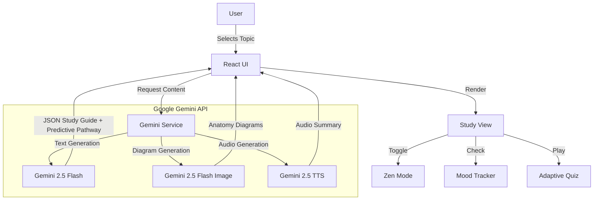

# 🏥 MedRecap AI

**Rapid Clinical Integration for Doctors & Students.**
> Bridges the gap between Foundational Sciences (Year 1) and Clinical Application (Year 3) using **Google Gemini 2.5**.

---

## 🌟 Core Benefits

### 1. 🤖 AI for Healthcare
MedRecap leverages **Gemini 2.5 Flash** and **Imagen** to automate the creation of high-yield medical study materials.
*   **Predictive Study Pathways**: Uses AI to analyze your progress and suggest the next logical topic to study (e.g., "After Circle of Willis, study Stroke Syndromes").
*   **Smart Difficulty**: Quiz difficulty adapts (Easy/Medium/Hard) to challenge the student appropriately.
*   **Automated Reasoning**: Generates "second-order" clinical vignette questions that mimic actual board exams (USMLE).

### 2. 🧠 Mental Health & Wellness (Burnout Prevention)
Medical education is stressful. We designed MedRecap to reduce cognitive load and anxiety.
*   **Mental Fatigue Tracker**: Built-in "Mood Check" on the dashboard. If you report high stress, the app suggests a quick breathing exercise.
*   **Zen Mode 🧘**: A distraction-free reading environment that hides clutter and uses calming colors to lower visual stress.
*   **Gamification**: Earn points (XP) and maintain streaks to turn studying into a rewarding habit, boosting dopamine and motivation.

### 3. ♿ Accessibility & Patient Support
We believe medical education should be accessible to everyone.
*   **Text-to-Speech (TTS) 🔊**: Built-in AI audio summaries and Quiz Question reading allow auditory learners to consume content effectively.
*   **High Contrast & Large Text**: Dedicated settings for visual accessibility.
*   **Multi-Modal Learning**: Combines text, audio, generated images, and interactive sketches to support diverse learning styles (Visual, Auditory, Kinesthetic).

### 4. 🌍 Public Health & Community Impact
Better trained doctors mean better patient outcomes.
*   **Offline Ready Design**: The UI is optimized to work well on mobile devices in low-bandwidth areas (simulated offline capabilities).
*   **Global Guidelines**: Integrated links to global medical resources (WHO, PubMed) ensure students learn standardized care.
*   **Knowledge Sharing 🤝**: One-click sharing of topics facilitates peer-to-peer learning.

---

## 🏗️ Architecture

### 🧩 System Flow

### 🛠️ Tech Stack

*   **Frontend**: React 19, TypeScript, Tailwind CSS
*   **AI Logic**: `gemini-2.5-flash` (Content & Quiz)
*   **AI Vision**: `gemini-2.5-flash-image` (Anatomy Diagrams)
*   **AI Voice**: `gemini-2.5-flash-preview-tts` (Accessibility)
*   **Visualization**: Mermaid.js (Process Flows)

---

## 🚀 How to Use

1.  **Check In**: Use the Mood Tracker on the dashboard to assess your focus.
2.  **Search**: Enter any medical topic (e.g., "Circle of Willis").
3.  **Listen**: Click the **Listen** button to hear an AI-narrated summary.
4.  **Focus**: Toggle **Zen Mode** or **High Contrast** via Settings.
5.  **Quiz**: Select "Hard" difficulty to test your clinical reasoning.
6.  **Track**: Watch your XP and Streaks grow on the dashboard.
