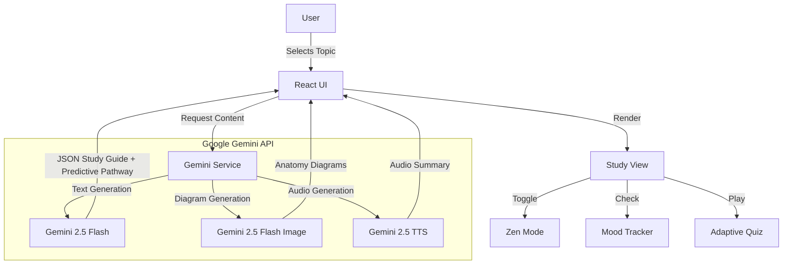

# 🏥 MedRecap AI

**Gamified, AI-Powered Medical Learning Platform for Clinical Mastery, Wellness, and Accessibility.**

> A specialized medical study aid bridging foundational sciences with clinical application. Ideal for doctors and students to quickly recap topics with depth.

---

## 📖 Introduction / Problem Statement

Medical students often struggle to bridge foundational sciences and clinical application while managing cognitive load and stress. The sheer volume of information leads to burnout, and traditional study methods often lack the adaptability required for neurodiverse learners or those needing rapid clinical integration.

**MedRecap AI** solves this by generating adaptive study guides, gamified quizzes, and visual recall exercises using Gemini 2.5 to create a personalized, stress-free learning environment.

---

## 🌟 Core Pillars

### 1. 🤖 AI for Healthcare
Real-time generation of high-yield content tailored to the user's needs.
*   **Real-time study guide & diagram generation:** Uses Gemini 2.5 AI to create instant content.
*   **Predictive study pathways:** AI suggests which topics a student should learn next based on quiz performance.
*   **Natural language question answering:** Ask any clinical question via the floating chat to get AI-generated explanations with cited sources.
*   **Smart difficulty adjustment:** Quizzes adapt in real time to the student’s skill level.

### 2. 🧠 Mental Health & Wellness
Designed to reduce cognitive load and preventing burnout during intense study sessions.
*   **Gamified learning:** Streaks, points (XP), and matching games turn studying into a rewarding habit.
*   **Visual recall & flowcharts:** Reduces text density to lower cognitive load.
*   **Stress/mental fatigue tracker:** Quick self-assessment surveys to gauge focus and stress on the dashboard.
*   **Mindfulness reminders:** Pop-ups encouraging breaks or short breathing exercises when stress is detected.
*   **Zen Mode:** A "Focus mode" that hides unnecessary UI to reduce overwhelm while studying.

### 3. ♿ Accessibility & Patient Support
Ensuring medical education is accessible to all learners, including those with diverse needs.
*   **Text-to-speech (TTS):** Listen to study guides and clinical vignettes for auditory learning.
*   **High-contrast mode / font size adjustments:** Dedicated settings for visual accessibility.
*   **Dual learning modes:** Foundational vs Clinical view — helps neurodiverse learners connect concepts.
*   **Interactive mnemonics & visual recall:** Users can choose auditory, visual, or interactive learning styles.

### 4. 🌍 Public Health & Community Impact
Scalable education for better-prepared doctors globally.
*   **Global resource library:** Integration with standardized clinical guidelines (WHO, PubMed) ensures global applicability.
*   **Offline mode:** The application is designed to be lightweight and functional in regions with limited internet access.
*   **Cloud syncing:** Students can continue study sessions anywhere (simulated via local storage).
*   **Impact metrics:** Tracks progress to simulate population-level benefits of better-prepared clinicians.

---

## ✨ Key Features

### 🧠 AI-Powered Study Guides
*   **Dual-View Learning:** Seamlessly switch between Foundational Sciences (Year 1) and Clinical Application (Year 3).
*   **Mnemonics & High-Yield Key Points:** Automatically generated memory aids for rapid retention.
*   **Mermaid.js Flowcharts:** Visualizes complex pathways (e.g., nervous system tracts) instantly.

### 🎮 Gamified Learning
*   **Matching Games:** Active recall mini-games for terminology.
*   **Visual Recall:** AI-generated anatomical diagrams with hide/reveal functionality for self-testing.
*   **Interactive Sketchpad:** Draw directly on the screen to reinforce spatial memory.

### 📝 Smart Quiz System
*   **Clinical Vignettes:** USMLE-style questions generated on the fly.
*   **Adaptive Difficulty:** Easy, Medium, and Hard modes that adjust based on performance.
*   **AI Analytics Dashboard:** Visualizes progress, streaks, and mastery levels.

### ♿ Accessibility & Inclusion
*   **Text-to-Speech:** Integrated audio synthesis for all content.
*   **Visual Settings:** High contrast and large text toggles in the header.
*   **Mobile-Friendly:** Responsive design that works on phones, tablets, and desktops.

---

## 🏗️ Architecture

### 🧩 System Flow

### 🛠️ Tech Stack

*   **Frontend**: React 19, TypeScript, Tailwind CSS
*   **AI Logic**: `gemini-2.5-flash` (Content & Quiz)
*   **AI Vision**: `gemini-2.5-flash-image` (Anatomy Diagrams)
*   **AI Voice**: `gemini-2.5-flash-preview-tts` (Accessibility)
*   **Visualization**: Mermaid.js (Process Flows)

---

## 🚀 How to Use

1.  **Check In**: Use the **Mental Fatigue Tracker** on the dashboard to assess your focus.
2.  **Search**: Enter any medical topic (e.g., "Circle of Willis").
3.  **Listen**: Click the **Listen** button to hear an AI-narrated summary (Text-to-Speech).
4.  **Focus**: Toggle **Zen Mode** or **High Contrast** via Settings to reduce overwhelm.
5.  **Study**: Review the Dual-View content, play the Matching Game, or use the Sketchpad.
6.  **Quiz**: Select "Hard" difficulty to test your clinical reasoning with AI-generated vignettes.
7.  **Track**: Watch your **XP and Streaks** grow on the dashboard.
