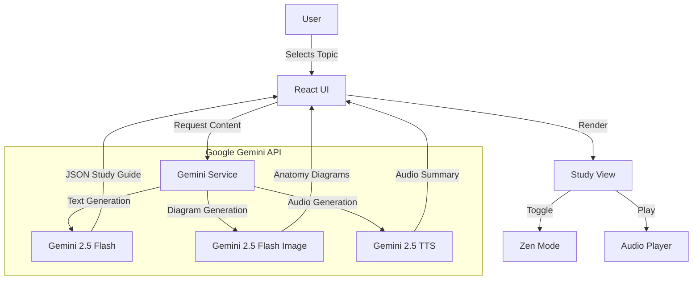

# 🏥 MedRecap AI

**Rapid Clinical Integration for Doctors & Students.**
> Bridges the gap between Foundational Sciences (Year 1) and Clinical Application (Year 3) using **Google Gemini 2.5**.

---

## 🌟 Core Benefits

### 1. 🤖 AI for Healthcare
MedRecap leverages **Gemini 2.5 Flash** and **Imagen** to automate the creation of high-yield medical study materials.
*   **Intelligent Curation**: Instantly bridges complex anatomy with clinical pathology.
*   **Visual Generation**: Creates diagrams and flowcharts on demand, saving hours of manual searching.
*   **Automated Reasoning**: Generates "second-order" clinical vignette questions that mimic actual board exams (USMLE), ensuring doctors are prepared for real-world diagnostic challenges.

### 2. 🧠 Mental Health & Wellness (Burnout Prevention)
Medical education is stressful. We designed MedRecap to reduce cognitive load and anxiety.
*   **Zen Mode 🧘**: A distraction-free reading environment that hides clutter and uses calming colors to lower visual stress during long study sessions.
*   **Gamification**: Matching games and interactive quizzes turn rote memorization into active play, increasing dopamine and reducing the "chore" of studying.
*   **Efficient Workflows**: By summarizing "High Yield" facts instantly, we help students learn faster and sleep more.

### 3. ♿ Accessibility & Patient Support
We believe medical education should be accessible to everyone.
*   **Text-to-Speech (TTS) 🔊**: Built-in AI audio summaries (powered by `gemini-2.5-flash-preview-tts`) allow auditory learners and those with visual impairments to consume content effectively.
*   **Multi-Modal Learning**: Combines text, audio, generated images, and interactive sketches to support diverse learning styles (Visual, Auditory, Kinesthetic).
*   **Simplified UI**: High contrast, large typography, and clear navigation ensure usability for all ages and abilities.

### 4. 🌍 Public Health & Community Impact
Better trained doctors mean better patient outcomes.
*   **Knowledge Sharing 🤝**: One-click sharing of topics and summaries facilitates peer-to-peer learning and mentorship.
*   **Scalability**: As a web-based platform, this tool can be deployed globally to resource-constrained settings, providing top-tier medical education aids where textbooks are scarce.
*   **Up-to-Date Info**: Integrated Google Search grounding ensures students aren't learning from outdated static text, but have access to the latest clinical guidelines.

---

## 🏗️ Architecture

### 🧩 System Flow

### 🛠️ Tech Stack

*   **Frontend**: React 19, TypeScript, Tailwind CSS
*   **AI Logic**: `gemini-2.5-flash` (Content & Quiz)
*   **AI Vision**: `gemini-2.5-flash-image` (Anatomy Diagrams)
*   **AI Voice**: `gemini-2.5-flash-preview-tts` (Accessibility)
*   **Visualization**: Mermaid.js (Process Flows)

---

## 🚀 How to Use

1.  **Search**: Enter any medical topic (e.g., "Circle of Willis").
2.  **Listen**: Click the **Listen** button to hear an AI-narrated summary while on the go.
3.  **Focus**: Toggle **Zen Mode** (top right) to block out distractions.
4.  **Visualize**: Generate anatomical diagrams or sketch your own notes.
5.  **Share**: Use the Share button to send the summary to study groups.
6.  **Quiz**: Test your knowledge with AI-generated clinical vignettes.